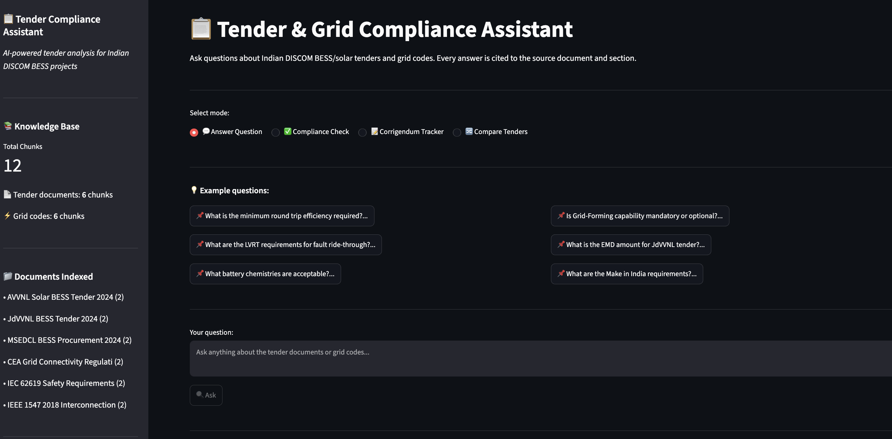
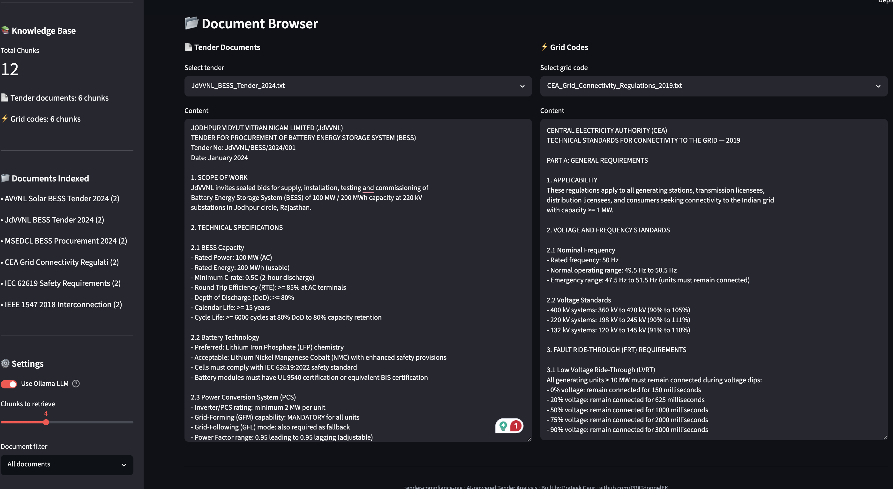

# tender-compliance-rag 📋

> **AI-powered Tender & Grid Compliance Assistant for Indian DISCOM BESS Projects**
> RAG pipeline · Ollama (mistral + nomic-embed-text) · FAISS · Streamlit

---

## 🎯 What This Is

A Retrieval-Augmented Generation (RAG) system that indexes Indian power sector tender documents and grid codes, then answers compliance questions in natural language — with every answer **cited to the exact source document and section**.

Built directly from real-world experience analyzing JdVVNL, AVVNL, and MSEDCL BESS tenders.

---

## 📸 Screenshots

### Tender & Grid Compliance Assistant — 4 Query Modes


### Document Browser — Tenders & Grid Codes


---

## 🌐 Live Demo

**Try it now — no installation required:**

[](https://tender-compliance-rag-ej3hpahnvtu6yaf3bvtijw.streamlit.app/)

> Ask: *"Is Grid-Forming capability mandatory?"* or *"What changed in the JdVVNL corrigendum?"*

---

## 💡 Why This Exists

Indian DISCOM tenders for BESS and solar projects are 100–200 page documents. Missing one requirement — a corrigendum that changed Grid-Forming from "preferred" to "mandatory" — can disqualify an entire bid worth ₹500 crore.

This tool lets a bid manager ask in plain English:
- *"Is Grid-Forming capability mandatory?"*
- *"What changed in the corrigendum?"*
- *"Does our 83% RTE meet the MSEDCL requirement?"*
- *"Compare cycle life requirements across all three tenders"*

And get a cited answer in seconds.

---

## 🏗️ Architecture

```
Tender PDFs + Grid Codes
        ↓
Section-aware chunking (400 words, 80-word overlap)
        ↓
Embeddings (Ollama: nomic-embed-text, 768-dim)
        ↓
FAISS Vector Index
        ↓
Query → Retriever (cosine similarity + re-ranking)
        ↓
Top-5 chunks + citations → LLM (Ollama: mistral)
        ↓
Cited answer with source references
        ↓
Streamlit UI
```

---

## 📦 Project Structure

```
tender-compliance-rag/
├── data/
│   ├── document_generator.py     # Synthetic tender + grid code documents
│   ├── tenders/                  # Tender documents (add real PDFs here)
│   └── grid_codes/               # Grid code excerpts (CEA, IEEE 1547, IEC 62619)
│
├── ingestion/
│   └── ingest.py                 # Chunking + embedding + FAISS index builder
│
├── rag/
│   ├── retriever.py              # FAISS similarity search + re-ranking
│   └── generator.py              # Ollama LLM answer generation with citations
│
├── dashboard/
│   └── app.py                    # Streamlit UI — 4 modes
│
├── streamlit_app.py              # Streamlit Cloud deployment version
├── requirements.txt              # Local requirements
├── requirements_cloud.txt        # Streamlit Cloud requirements
├── screenshots/
│   ├── compliance_assistant.png
│   └── document_browser.png
└── README.md
```

---

## ⚙️ Tech Stack

| Layer | Technology |
|---|---|
| Language | Python 3.10+ |
| Embeddings | Ollama — nomic-embed-text (768-dim) |
| LLM | Ollama — mistral (local, private) |
| Vector Search | FAISS (numpy-based cosine similarity) |
| Chunking | Section-aware (numbered heading detection) |
| Dashboard | Streamlit |
| PDF Processing | pypdf (for real tender PDFs) |

---

## 🚀 Quick Start

```bash
git clone https://github.com/PRATdoppelEK/tender-compliance-rag.git
cd tender-compliance-rag

pip install -r requirements.txt

# Install Ollama models
ollama pull mistral
ollama pull nomic-embed-text

# Step 1: Generate synthetic tender documents
python data/document_generator.py

# Step 2: Ingest and index documents
python ingestion/ingest.py

# Step 3: Launch the dashboard
streamlit run dashboard/app.py
```

---

## 💬 4 Query Modes

### 1. Answer Question
Ask anything about tender requirements:
```
Q: What is the minimum round trip efficiency required?
A: JdVVNL requires >= 85% RTE (AC terminals). MSEDCL requires >= 85% AC-AC.
   AVVNL specifies >= 87% including transformer losses.
   [Source: JdVVNL_BESS_Tender — Section 2.1 BESS Capacity]
```

### 2. Compliance Check
Check if your specs meet requirements:
```
Q: Does 83% round trip efficiency meet the MSEDCL requirement?
VERDICT: FAIL
REQUIREMENT: >= 85% AC-AC (MSEDCL Tender Section 2.2)
ASSESSMENT: 83% is 2% below the minimum threshold.
RECOMMENDATION: Improve system design or negotiate threshold.
```

### 3. Corrigendum Tracker
Track all changes across amendments:
```
Q: What changed in the JdVVNL corrigendum?
- Corrigendum 1: Grid-Forming changed from "preferred" to "MANDATORY"
- Corrigendum 2: Cycle life increased from 5000 to 6000 cycles
- Corrigendum 3: Added IEC 62443 cybersecurity requirement
```

### 4. Compare Tenders
Side-by-side comparison:
```
Q: Compare round trip efficiency requirements across tenders
| Tender  | RTE Requirement | Basis         |
|---------|-----------------|---------------|
| JdVVNL  | >= 85%          | AC terminals  |
| MSEDCL  | >= 85%          | AC-AC         |
| AVVNL   | >= 87%          | Including Tx  |
Strictest: AVVNL (87% including transformer losses)
```

---

## 📄 Documents Indexed

### Tender Documents
| Document | Capacity | Utility |
|---|---|---|
| JdVVNL BESS Tender 2024 | 100 MW / 200 MWh | Jodhpur, Rajasthan |
| AVVNL Solar + BESS 2024 | 50 MW + 25 MW/50 MWh | Ajmer, Rajasthan |
| MSEDCL BESS Procurement 2024 | 500 MW / 1000 MWh | Maharashtra |

### Grid Codes
| Document | Standard | Scope |
|---|---|---|
| CEA Grid Connectivity Regulations 2019 | Indian | LVRT, frequency, protection |
| IEC 62619:2022 | International | Lithium battery safety |
| IEEE 1547-2018 | International | DER interconnection |

---

## 📄 Adding Real Tender Documents

```bash
# Drop your PDF files into:
data/tenders/your_tender.pdf
data/grid_codes/your_grid_code.pdf

# Re-run ingestion
python ingestion/ingest.py
```

---

## 🔒 Privacy

- **100% local** — Ollama runs on your machine
- No data sent to OpenAI, Anthropic, or any cloud API
- Suitable for confidential bid documents
- DPDP Act 2023 compliant

---

## 📅 Build Status

| Component | Status |
|---|---|
| Synthetic document generator | ✅ Done |
| Section-aware chunking | ✅ Done |
| Ollama embedding pipeline | ✅ Done |
| FAISS vector index | ✅ Done |
| Query expansion + re-ranking | ✅ Done |
| LLM answer generation | ✅ Done |
| Source citation system | ✅ Done |
| Streamlit dashboard (4 modes) | ✅ Done |
| PDF ingestion support | ✅ Done |
| Streamlit Cloud deployment | ✅ Done |

---

## 👤 Author

**Prateek Gaur** — ML Engineer, Munich
GitHub: [@PRATdoppelEK](https://github.com/PRATdoppelEK)

---

## 📄 License

MIT
